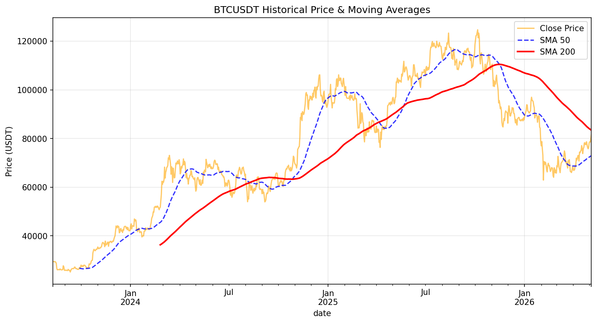
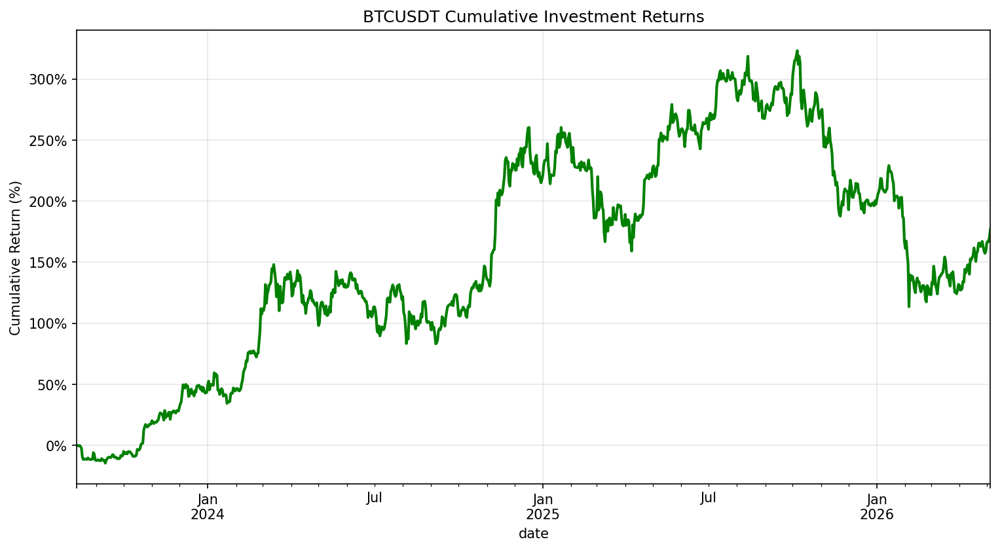
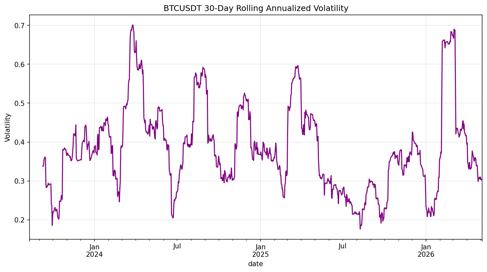
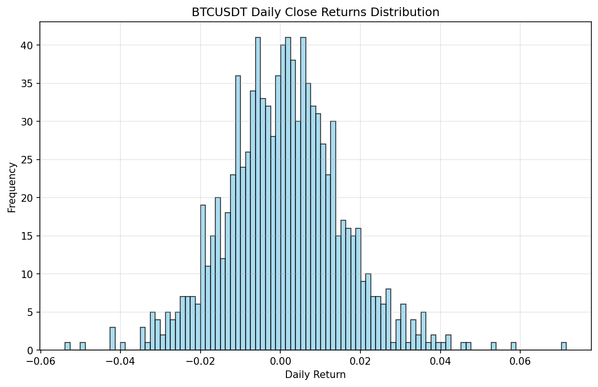

# 📈 Cryptocurrency Data Analysis

Automated data pipeline for fetching, analyzing, and visualizing historical cryptocurrency prices.

## Goal
The primary objective of this project is to provide a clean, reliable, and "one-click" environment for analyzing cryptocurrency market data. It replaces deprecated methods with the modern **Binance Public API** and includes features designed for quick demonstrations and interviewer review.

## Architecture
- **Data Ingestion**: `crypto_data.py` handles API requests to Binance (OHLCV klines) with automatic fallback to synthetic data if offline.
- **Analysis Pipeline**: `run_all.py` orchestrates fetching, statistical analysis, and plot generation.
- **Notebook Interface**: `Crypto_Analysis.ipynb` for interactive exploratory data analysis (EDA).
- **Visualization**: Generates historical price trends and returns distribution histograms.

## Getting Started

### 1. Prerequisites
- Python 3.9+
- No API keys required (uses public Binance endpoints).

### 2. Installation
```bash
pip install -r requirements.txt
```

### 3. Quick Execution (Recommended for Interviews)
Run the entire pipeline in one command. It will fetch 1000 days of Bitcoin data, perform volatility analysis, and save plots to the `output/` directory:
```bash
python run_all.py
```

### 4. Running Offline / Mock Mode
If you want to test the pipeline without an internet connection or Binance API:
```bash
# Windows (PowerShell)
$env:MOCK_DATA="true"; python run_all.py

# Linux / macOS
MOCK_DATA=true python run_all.py
```

### 5. Interactive Analysis
Launch Jupyter to explore the notebook:
```bash
jupyter lab Crypto_Analysis.ipynb
```

## Features
- **Modern API Integration**: Uses Binance v3 API for high-quality OHLCV data.
- **Mock Data Engine**: Built-in random walk generator for synthetic price data.
- **Advanced Financial Analytics**: 
    - Trend analysis using Moving Averages (SMA 50/200).
    - Investment performance tracking via Cumulative Returns.
    - Risk assessment with Rolling Annualized Volatility.
- **Production-Ready**: Includes a CLI-ready script (`run_all.py`) and a non-interactive matplotlib backend for headless environments.
## Expected Outputs

When you run the pipeline, the following visualizations will be generated and can be viewed in the `assets/` directory:

### 1. Price History & SMA


### 2. Cumulative Returns


### 3. Rolling Volatility


### 4. Returns Distribution


## Features

## Project Structure
- `run_all.py`: Main orchestrator and entry point.
- `crypto_data.py`: API and Mock data utility module.
- `Crypto_Analysis.ipynb`: Interactive research notebook.
- `output/`: Directory where generated plots are saved.
- `test_analysis.py`: End-to-end unit test suite.

---
**Author:** Jose Betancur
